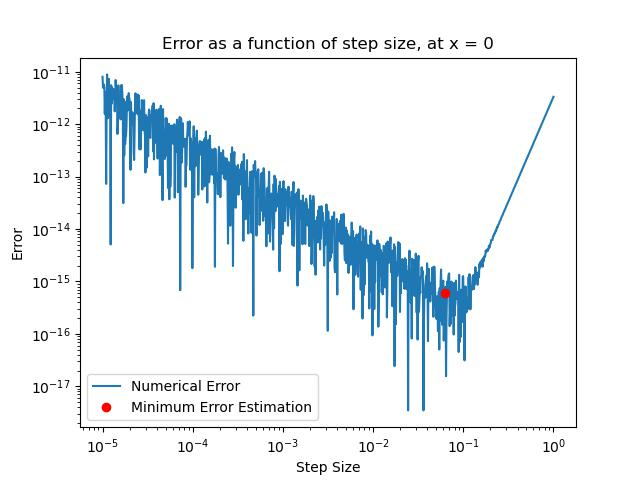

# Assignment 1

By Christian Mauffette Denis

## Question 1

### a)

We can use a different formula to compute the derivative using the given points. We know that

$$f(x + \delta) = f(x) + f'(x) \delta + \frac{f''(x)}{2}\delta^2 + \frac{f'''(x)}{6}\delta^3 + \frac{f^{(4)}(x)}{24}\delta^4 + \frac{f^{(5)}(x)}{120}\delta^5 + ...  $$

$$f(x - \delta) = f(x) - f'(x) + \frac{f''(x)}{2}\delta^2 - \frac{f'''(x)}{6}\delta^3 + \frac{f^{(4)}(x)}{24}\delta^4 - \frac{f^{(5)}(x)}{120}\delta^5 + ...  $$

$$f(x + 2\delta) = f(x) + 2 f'(x) \delta + \frac{4 f''(x)}{2}\delta^2 + \frac{8 f'''(x)}{6}\delta^3 + \frac{16 f^{(4)}(x)}{24}\delta^4 + \frac{32 f^{(5)}(x)}{120}\delta^5 + ...  $$

$$f(x - 2\delta) = f(x) - 2 f'(x) \delta + \frac{4 f''(x)}{2}\delta^2 - \frac{8 f'''(x)}{6}\delta^3 + \frac{16 f^{(4)}(x)}{24}\delta^4 - \frac{32 f^{(5)}(x)}{120}\delta^5 + ...  $$

If we subtract the first two expression we get:

$$f(x + \delta) - f(x - \delta) = 2 f'(x) \delta + \frac{ 2 f'''(x)}{6}\delta^3 + \frac{2 f^{(5)}(x)}{120}\delta^5 + ...  $$

$$ = 2 f'(x) \delta + \frac{ f'''(x)}{3}\delta^3 + \frac{ f^{(5)}(x)}{60}\delta^5 + ...  $$

Now we subtract the two last expressions:

$$ f(x + 2\delta) - f(x - 2\delta) = 4 f'(x) \delta  + \frac{8 f'''(x)}{3}\delta^3 + \frac{8 f^{(5)}(x)}{15}\delta^5 + ...  $$

This means we can get rid of the 3rd order corrections by doing:

$$\frac{2}{3} \left((f(x + \delta)-f(x-\delta ))-\frac{1}{8} (f(x + 2 \delta)-f(x-2 \delta ))\right) = f'(x)\delta -\frac{1}{30} f^{(5)}(x) \delta^5 + O\left(x^6\right)$$

Hence the error term is

$$\frac{1}{30} f^{(5)}(x) \delta^4$$

And the estimate will be

$$\frac{2}{3 \delta} \left((f(x + \delta)-f(x-\delta ))-\frac{1}{8} (f(x + 2 \delta)-f(x-2 \delta ))\right)$$

### b)

If the roundoff error is $\epsilon$, then the error is bounded by

$$\frac{2}{3 \delta} \left(\epsilon-(-\epsilon)-\frac{1}{8} ((-\epsilon)-\epsilon)\right) + \frac{1}{30} f^{(5)}(x) \delta^4 = \text{error}$$

$$\frac{2}{3 \delta} \left(2 \epsilon-\frac{\epsilon}{4} \right) + \frac{1}{30} f^{(5)}(x) \delta^4 = \text{error}$$

$$ \frac{7\epsilon}{6 \delta}  + \frac{1}{30} f^{(5)}(x) \delta^4 = \text{error}$$

Taking the derivative with respect to $\delta$ and setting it equal to 0 to minimize it we have:

$$ \frac{d}{d\delta} \left( \frac{7\epsilon}{6 \delta}  + \frac{1}{30} f^{(5)}(x) \delta^4 \right) = 0 $$

$$\frac{2 \delta ^3 k}{15}-\frac{7 \epsilon }{6 \delta ^2} = 0 $$

$$\implies \delta \approx \left( \frac{35 \epsilon}{4 f^{(5)}(x) } \right)^{1/5} $$

So, assuming machine precision is about $10^{-16}$, then we have about

$$\delta \approx 10^{-16/5} \approx 10^{-3.2}$$

We can now try this with code by evaluating the given functions with our derivative. First we create the derivative taking function.

```python
# Function to take the derivative at some point with a given step size
def deriv(func, x0, delta):
    return 2/(3*delta) * (func(x0 + delta) - func(x0 - delta) - 1/8*(func(x0 + 2*delta) - func(x0 - 2*delta)))
```

With this function, we can pick a ```x0``` and then scan (logarithmically) through different ```delta``` values. For the function $e^{x}$ whose derivative is evaluated at $x=0$, this produces the following plot:


We can see on it the estimated optimal error is indeed in the $10^{-3}$ ballpark. Also, it was assumed that the fifth derivative is roughly of order 1, which is exactly right for our specific function, since $\frac{d^5}{dx^5} e^x = e^x$.

Now we can try the same procedure, but for the $e^{0.01 x}$ function. Again, we scan the different deltas, and produce the following plot:



For this plot the order of magnitude of the 5th derivative was in fact significant since $\frac{d^5}{dx^5} e^x = (0.01)^5e^x$. Hence, the optimal step size had to be divided by $0.01$ and after doing so, we see that it does indeed fall roughly on the minimum of the curve for the error.

## Question 2

We now code a derivative taking function. We used the centered derivative for that. We simply use the formula

$$\frac{f(x+\Delta x)-f(x - \Delta x)}{2 \Delta x} = f'(x)$$

However, we must pick the appropriate $\Delta x$. If we look at the taylor expansion of the previous expression, we have

$$f(x + \delta) = f(x) + f'(x) \delta + \frac{f''(x)}{2}\delta^2 + \frac{f'''(x)}{6}\delta^3 + \frac{f^{(4)}(x)}{24}\delta^4 + \frac{f^{(5)}(x)}{120}\delta^5 + ...  $$

$$f(x - \delta) = f(x) - f'(x) + \frac{f''(x)}{2}\delta^2 - \frac{f'''(x)}{6}\delta^3 + \frac{f^{(4)}(x)}{24}\delta^4 - \frac{f^{(5)}(x)}{120}\delta^5 + ...  $$

$$\implies \frac{f(x+\Delta x)-f(x - \Delta x)}{2 \Delta x} = \frac{1}{2 \Delta x}\left( 2 f'(x) \Delta x + \frac{f'''(x)}{3}\Delta x^3\right) + ...$$

$$ =  f'(x)  + \frac{f'''(x)}{6}\Delta x^2 + ...$$

Hence, the error is

$$\text{error} \approx \frac{\epsilon}{\Delta x}  + \frac{f'''(x)}{6}\Delta x^2$$

If we minimize it with respect to $\Delta x$, we have

$$\Delta x \approx \left(\frac{3 \epsilon}{f'''(x)} \right)^{1/3}$$

We will code a function that will find the 3rd derivative with a delta value that is not optimal and then use that derivative to find the first derivative, but this time with a delta that is quite optimal. I am assuming that the error will be relatively small in the 3rd derivative, hence, it should not be too much of a problem since it's only used to roughly find the optimal value for the derivative.

We still need to find some delta to use that is not too far-fetched for the three consecutive derivatives. In class we have seen that to minimize the error for such a derivative prescription (central), we must use $\Delta x \approx 10^{-5}$, assuming second derivatives are not too crazy and that our machine $\epsilon$ is $\approx 10^{-16}$.

```python

def ndiff(fun, x, full = False):
    '''Function to take a derivate. Optional: can output the estimated error on the result.'''
    
    ini_step = 10**-5 # Initial step size (for third derivative)
    
    # Anonymous function to take derivatives
    diff_op = lambda func, x: (func(x + ini_step) - func(x - ini_step))/(2*ini_step)

    deriv_1 = lambda x: diff_op(fun, x)     # Calculating the first derivative
    deriv_2 = lambda x: diff_op(deriv_1, x) # Calculating the second derivative
    deriv_3 = lambda x: diff_op(deriv_1, x) # Calculating the thirs derivative
    
    # Optimal step size
    third_deriv = deriv_3(x)
    print(third_deriv)
    opt_step = (abs(3*np.finfo(float).eps/third_deriv))**(1/3)
    
    # Finding the derivative
    deriv = (fun(x + opt_step) - fun(x - opt_step))/(2*opt_step)

    # Conditional system for optional argument
    if full:
        # Returns derivative and estimated error
        est_err = np.finfo(float).eps/opt_step + third_deriv*opt_step**2/6
        return np.array([deriv, est_err])
    
    elif not full:
        # Returns only derivative
        return deriv
```
