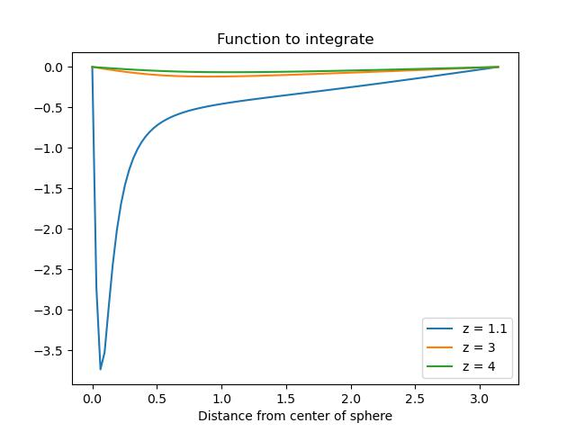
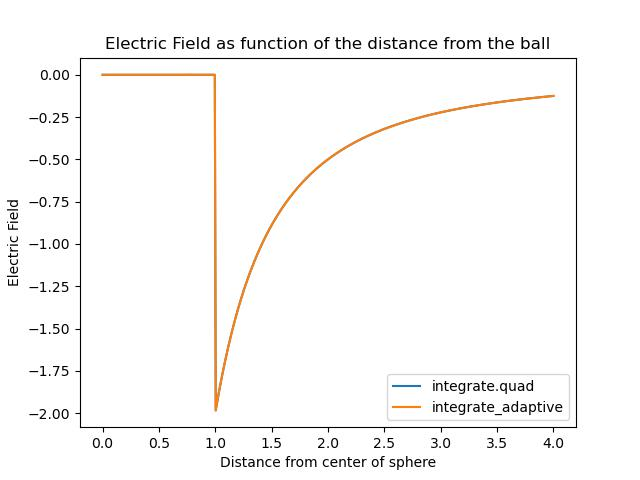
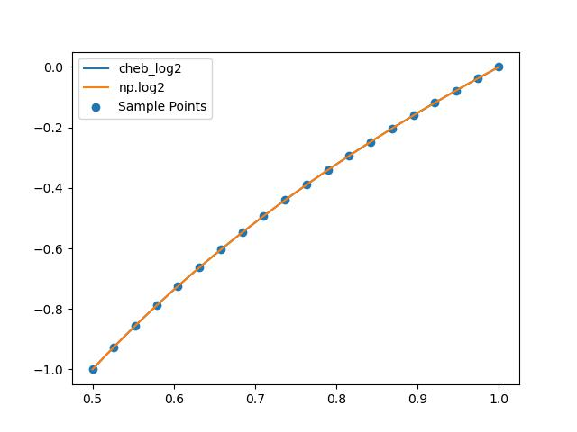
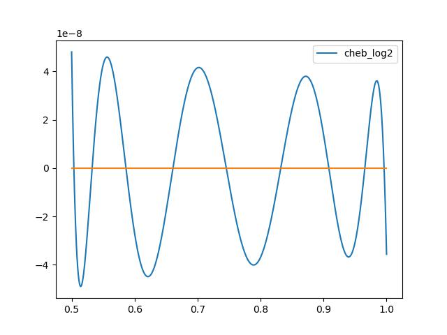
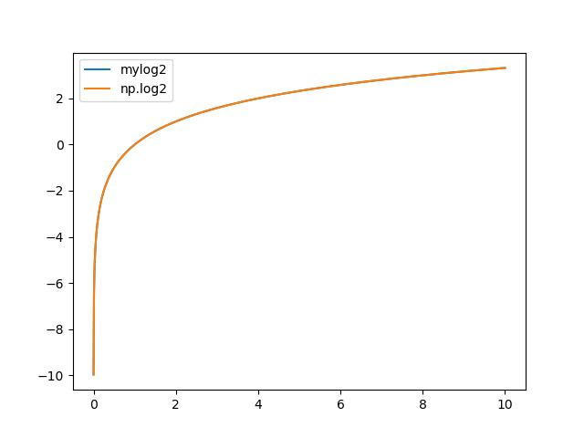
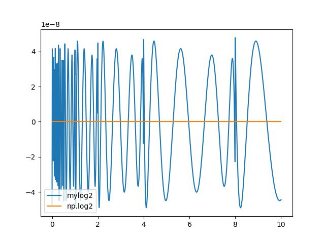
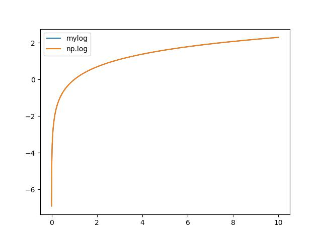
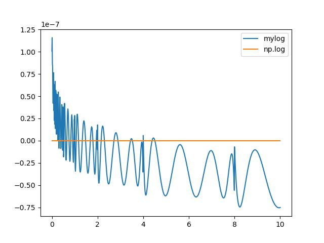

# Assignment 2

By Christian Mauffette Denis

For PHYS-512

## Question 1

We first look at the electric field of a uniformily charged ring. We kow that, along the central axis of this ring, we have the field

$$E_c = -\frac{Q z}{4\pi \epsilon_0(z^2 + R^2)^{3/2}} $$

(found on [Hyperphysics](http://hyperphysics.phy-astr.gsu.edu/hbase/electric/elelin.html)). If we integrate this function at all angles from the center of the sphere (which is made of infinitelly thin rings) we can obtain the resulting function for the total electric field of the sphere. The integral we must consider, based on Problem 2.8 in Griffith's Introduction to electrodynamics is :

$$E_z(z) = \frac{ R^2 \sigma}{2 \epsilon_0} \int_0^\pi \frac{(z - R \cos \theta) \sin \theta}{\left(R^2 + z^2 - 2Rz \cos \theta \right)^{3/2}} d\theta$$

The function inside the integral is

$$\frac{ R^2 \sigma}{2 \epsilon_0} \frac{(z - R \cos \theta) \sin \theta}{\left(R^2 + z^2 - 2Rz \cos \theta \right)^{3/2}}$$

This function looks like the following:



As we approach the shell, at $z=1$ (the radius of the shell) we have a discontinuity at 0.

We then coded this function and passed it in both our own integrator and in `scipy`'s `integrate.quad`. The results are as follows (scanning through different $z$ values):



The curves given by the two integrators are basically indistinguishable.

The integration was done on the $[0, \pi]$ range for `integrate.quad`, but we used $(0, \pi]$ for the `intergrate_adaptive` function. This is because our custom function does not deal with the discontinuity/singularity at $z=1$ well, however `integrate.quad` does not have any problems with it. We used the following functions for this:

```python
def to_int(theta, z):
    # Function to integrate. Without loss of generality we rescale it by making the coefficient 1.
    coeff = 1 #2*np.pi*R**2*sigma/(4*np.pi*cons.epsilon_0)
    return -coeff*(z-R*np.cos(theta))*np.sin(theta)/(R**2 + z**2 - 2*R*z*np.cos(theta))**(3/2)

def efield_quad(z):
    '''Function that integrates the above function for a given z. Done with quad.'''
    temp_func = lambda theta : to_int(theta, z) # Anonymous function
    return integrate.quad(temp_func, 0, np.pi) # Integration

def efield_custom(z):
    '''Function that integrates the above function for a given z. Done with custom adaptive integrator.'''
    temp_func = lambda theta : to_int(theta, z) # Anonymous function
    return integrate_adaptive(temp_func, 0.00001, np.pi, 0.001) # Integration
```

Notice the 0.00001 starting bound instead of the 0 bound for the adaptive integration.

## Question 2

To answer this question, we create the following function using the same method that we coded in class:

```python
    def integrate_adaptive(fun, a, b, tol, extra = None):
        print('calling adaptive function from ', a, b)
        sub_div = 5
        if extra == None:
            x = np.linspace(a, b, sub_div)
            dx = x[1] - x[0]
            y = fun(x)
        else:
            x = np.linspace(a, b, sub_div)
            dx = x[1] - x[0]
            y = np.array([extra[0], fun(x[1]), extra[1], fun(x[3]), extra[2]])

        # Approximate integral
        i1 = (y[0]+4*y[2]+y[4])/3*(2*dx)
        i2 = (y[0]+4*y[1]+2*y[2]+4*y[3]+y[4])/3*dx
        myerr = np.abs(i1-i2)
        if myerr < tol:
            return i2
        else:
            mid = (a+b)/2
            int1 = integrate_adaptive(fun, a, mid, tol/2, extra = [y[0], y[1], y[2]])
            int2 = integrate_adaptive(fun, mid, b, tol/2, extra = [y[2], y[3], y[4]])
            return int1+int2

```

It works like this: in the very first function call, the `extra` argument is `None`, hence it simply creates a vector array, evaluates the step size of this array and creates an array for the image of the inputted function. Once this is done we calculate the integral using two different integrating methods of different order. If the two methods yield results which differ by less than the input tolerance, we conclude that the integral is accurate enough, so we output the higher order integration result. However, if the difference is greater than the tolerance, we then separate our interval in two interval of same size. For each of these intervals we then repeat the same protocol as before.

This time, there is one difference: we already know the value of some of our points, from the previous division, namely the starting, middle value and ending point. This means that when we generate our `y` array, we use those values instead of recalculating them. To do this, we pass them in the `extra` argument, which is now not `None` anymore. As can be seen in the code snippet, they are put in an array along with only two other newly generated `y` values.

**How many function calls are we saving?** Well, with the regular method, at each new recusion step we'd be making 10 function calls (5 for each intervals). With this new method, we'd be calling it only 4 times (2 for each intervals). So assuming the number of recursion is relatively large, hence allowing us to neglect the initial 5 calls which are the same for both integrating functions, then we'd have 60% less calls.

Numerically, this hypothesis was tested with a gaussian, an exponential and a sine function, and the counts for the number of calls for the new integrator was indeed around 40% of the calls for the normal one (hence 60% less). `a2_q2.py` can be ran for evidence.

So far this has been only for 5 subdivision of our interval. In principle, this principle could be generalized to higher numbbers of division. The procedure to do this is not too complicate but requires a bit of planning regarding the way we replace values in our arrays. Here is one way of doing it in the else statement of the above function (`integrate_adaptive`):

```python
    new_int = b - a # Size of interval

    dx = new_int/(nb_sub-1) # Step size

    x = np.linspace(a, b, sub_div) # Get regular linspace

    y = fun(
        np.linspace(
            a + dx, 
            b - dx, 
            int((nb_sub - 1)/2)
            )
        ) # Evaluate the function only at the points we have not evaluated yet

    y = np.insert(
        second_array, 
        np.arange(int((nb_sub+1)/2)).astype(int), 
        first_array[:int((nb_sub - 1)/2)+1]
        ) # Fill in the blanks from the previous recursion call
```

A  problem with this method is that, although this works for creating the x and y array with an arbitrary large (odd) number of subdivion, the rest of the integrator will also have to be changed. It was built for 5 points, but should we want to use more than 5, the actual Simpson's rule will have to be adjusted.

If we managed to make such a function, following the same reasoning as before the number of calls we'd be saving is $n-1$ per recursion, which is pretty good. However, since we do require a lot of calls to functions like `insert` and two `linspace`s the method described above might not be more beneficial than calling the function 2 times more often. Perhaps there's a more clever way to do the above.

## Question 3

### Part a)

To answer this question we create the following function:

```python
def cheb_log2(x):
    return np.polynomial.chebyshev.Chebyshev(
        [-4.56893394e-01, 4.95054673e-01, -4.24689768e-02, 4.85768297e-03, -6.25084976e-04, 8.57981013e-05, -1.22671891e-05, 1.80404306e-06]
    )((x - 0.75) * 4)
```

This function was obtained by fitting 20 points of the $\log_2$ function. This function was actually rescaled from the $[0.5, 1]$ interval to the $[-1, 1]$ interval. Technically we were fitting the function

$$\log_2\left(4\cdot(x - 0.75) \right)$$

We obtained the appropriate coefficients for the fitted Chebyshev polynomials using `numpy`'s `polynomial.chebyshev.chebfit` function. This returns an array that contains the coefficient. We originally had 20 coefficients, but we truncated them so that the error falls in the desired bound of $10^{-6}$. This is pretty simple to do since we know that the Chebyshev polynomials are bounded by 1. This means that the maximum error on the function is the magnitude of the coefficient of the last term of the series. This leads us to pick a 9th order Chebyshev polynomial, which is the first one with a coefficient below $10^{-6}$. This indeed produces sensible result as can attest the following plots:




Once the coefficients are obtained, we used the `polynomial.chebyshev.Chebyshev` `numpy` function to evaluate the Chebyshev polynomials. We must actually rescale the input so that it goes from the $[0.5, 1]$ interval to $[-1, 1]$ interval. This is easily done by transforming the input like `(x-0.75)*4`.

### Part b)

The function `np.frexp` decomposes numbers into their mantissa and exponent. In other words, for a value "x", it breaks it down into $C$ and $N$, where those three number are related by

$$x = C 2^N. $$

If we take the $\log_2$ of such a value, we have

$$\log_2 x = \log_2 \left(C 2^N \right) $$

$$ = \log_2 (C ) + N. $$

The first term is simply an evaluation of the function we wrote in **Part a**, hence, we can write the following function to take a $\log_2$:

```python
def mylog2(x):
    mantissa, expo = np.frexp(x)
    return cheb_log2(x) + expo
```

We can see that this function actually works by looking at the plotted function and its residuals:




If we want to take the natural log of a function, then it's pretty straighforwards, we simply use the log properties and make the function:

```python
def mylog(x):
    return mylog2(x)/mylog(np.exp(1))
```

We see that this does indeed work:



