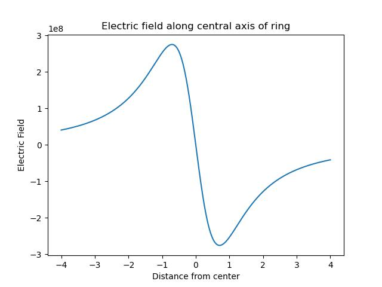

# Assignment 2

By Christian Mauffette Denis

For PHYS-512

## Question 1

We first look at the electric field of a uniformily charged ring. We kow that, along the central axis of this ring, we have the field

$$E_c = -\frac{Q z}{4\pi \epsilon_0(z^2 + R^2)^{3/2}} $$

(found on [Hyperphysics](http://hyperphysics.phy-astr.gsu.edu/hbase/electric/elelin.html)).

We can plot this function (with a total charge on the ring of 1 $C$, which is admidetly pretty large, and let's assume a radius of 1 $m$ for simplicity):



We see that as we get further away from the source in the positive axis we get pulled back towards it and similarly for the negative direction. When we are dead at the center of the ring, the symmetry creates a 0 field.


## Question 3

### Part a)

### Part b)

The function `np.frexp` decomposes numbers into their mantissa and exponent. In other words, for a value "x", it breaks it down into $C$ and $N$, where those three number are related by

$$x = C 2^N. $$

If we take the $\log_2$ of such a value, we have

$$\log_2 x = \log_2 \left(C 2^N \right) $$

$$ = \log_2 (C ) + N. $$

The first term is simply an evaluation of the function we wrote in **Part a**, hence, we can write the following function to take a $\log_2$:

```python
def mylog2(x):
    mantissa, expo = np.frexp(x)
    return cheb_log2(x) + expo
```
