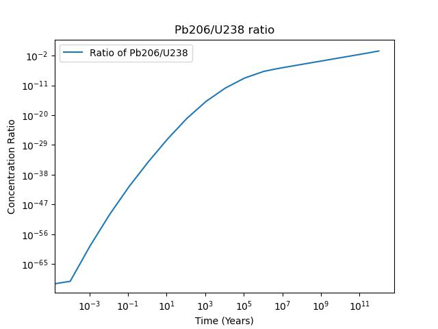
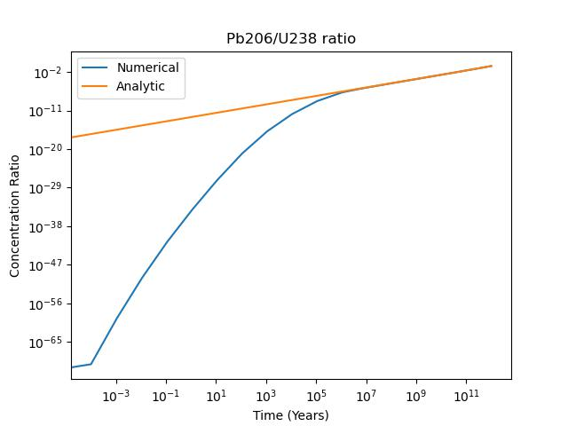

# Assignment 3

By Christian Mauffette Denis

For PHYS-512

## Question 1

## Question 2

Using `scipy`'s `integrate.solve_ivp` we carried out an integration of the chain of decay of U238 to Pb206. We started the simulation with a pure concentration of U238 (so nothing for the concentrations of any other elements). The integration was carried out using the Radau implicit integration method.

Since the half-life of U238 is quite long, $\approx 4 \text{billion years}$, we must look at a range of a similar magnitude to observe relevant transitions:




We can analytically estimate how this curve should look like. Assuming that the transition from U238 to Pb206 is mainly determined by the half-life of U238 to the next element (which is legitimate since it is a lot bigger in magnitude than the other half-lives), we can write up:

$$
\begin{cases}
\frac{d C_{\text{U238}}}{dt} = -\frac{C_{\text{U238}}}{t_{C_{\text{U238}}}},\\
\frac{d C_{\text{Pb206}}}{dt} = \frac{C_{\text{U238}}}{t_{C_{\text{U238}}}}
\end{cases}
$$

This is easily solvable (assuming initial conditions $C_{\text{U238}}(0)=1$ and $C_{\text{Pb206}}(0)=0$):

$$
\begin{cases}
C_{\text{U238}}(t) = e^{-\frac{t}{t_{C_{U238}}}},\\
C_{\text{Pb206}}(t) = 1 - e^{-\frac{t}{t_{C_{U238}}}}
\end{cases}
$$

Consequently the ratio of the two compounds as a function of time is simply

$$ R(t) = e^{t/C_{\text{U238}}} - 1$$



## Question 3

### Part a)

Initially the problem features nonlinear parameters. We can expand the expression to make the parameter linear. We get:

$$z = a (x^2 + y^2) - 2 a x_0 x - 2 a y y_0 + (x_0^2 a + a y_0^2 + z_0)$$

If we replace the coefficient in front of all the terms by new constants we get the equivalent expression, with also 4 degrees of freedom:

$$A (x^2 + y^2) + B x + C y + D = z$$

This is useful since we now have linear parameters that we can fit. However once we obtain them we will also have to extract the original quantities, $x_0$, $y_0$, $a$ and $z_0$. We can easily solve this in Mathematica:

```mathematica
Solve[
 {
  A1 == a,
  B1 == -2 a x0,
  c1 == -2 a y0,
  d1 == x0^2 a + a y0^2 + z0
  },
 {a, x0, y0, z0}
 ]
```

Yielding

```mathematica
{{a -> A1, x0 -> -(B1/(2 A1)), y0 -> -(c1/(2 A1)), 
  z0 -> (-B1^2 - c1^2 + 4 A1 d1)/(4 A1)}}
```

This means that our relations to go back to the old coordinate system is:

$$
\begin{cases}
a = A \\
x_0 = -\frac{B}{2 A} \\
y_0 = -\frac{C}{2 A} \\
z_0 = -\frac{B^2 + C^2 - 4 AD}{4 A}
\end{cases}
$$