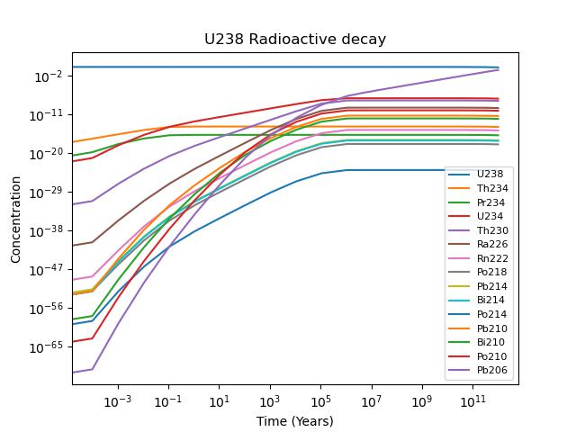

# Assignment 3

By Christian Mauffette Denis

For PHYS-512

## Question 1

### Part 1

The RK4 integrator was coded as follow:

```python
def rk4_step(fun, x, y, h):
    '''Runge-Kutta 4 step integrator'''
    k1 = h*fun(x, y)
    k2 = h*fun(x+h/2, y+k1/2)
    k3 = h*fun(x+h/2, y+k2/2)
    k4 = h*fun(x+h, y+k3)
    return y + (k1 +2*k2 + 2*k3 +k4)/6

```

It calculates the appropriate $k_n$ coefficients and then puts them together according to the RK4 method. We can see it in action in the following plot with the residuals.


We can see that the error is of magnitude $10^{-4}$. Overall the method does decently well at following the general cuve.

### Part 2)

Disclaimer: this method is heavily based on section 17.2 from Numerical Recipes.

We start by considering the result of a RK4 step. Since it is order 4 it means that the leading error on our result for a single step will be of the form

$$ \text{error}_h = h^5 \phi $$

where $\phi$ is simply a constant related to the derivative of our function. If we take two successive steps of half length, we end up with a different result:

$$ \text{error}_\frac{h}{2} = 2\frac{ h^5}{2^5} \phi =  \frac{ h^5}{16} \phi $$

We can then substract the two methods from each other with the right coefficient to get down to order 6 error. Let's label $r_1(x, y)$ as a single step integrator with size $h$ and $r_2(x, y)$ as a single step with size $\frac{h}{2}$. To cancel the 5th order error and preserve the magnitude of the answer we must write:

$$ \frac{16r_2(x, y) - r_1(x,y) }{15} = y(x+h) + O(6)$$

We can then code this using the previous RK4 function.

```python
def rk4_stepd(fun, x, y, h):
    first_step = rk4_step(fun, x, y, h/2)
    second_step = rk4_step(fun, x + h/2, first_step, h/2)
    return (16*second_step - rk4_step(fun, x, y, h) )/15
```

We essentially apply the `rk4_stepd` function twice using half the step size and then use it with the original method. We can see it do a lot better than the previous method:


The error is 3 orders of magnitude smaller than our original RK4 function. However in terms of computational cost, the one that we wrote, just now, evaluates three times the original function. However, we could modify it and reuse some of the function calls that were already used in `rk4_stepd`. Mainly, the first function call (at $x$ and $y$, where both method start). Hence we actually call the function $12-1 = 11$ times instead of only $4$. According to Numerical Recipes, this is not a fair comparison since our new function is now of order 5, which means it should be compared to 8 function calls as opposed to 4.

## Question 2

Using `scipy`'s `integrate.solve_ivp` we carried out an integration of the chain of decay of U238 to Pb206. We started the simulation with a pure concentration of U238 (so nothing for the concentrations of any other elements). The integration was carried out using the Radau implicit integration method. The RK4 method was briefly tested, but the running time was simply way too long.

Since the half-life of U238 is quite long, $\approx 4\ \text{billion years}$, we must look at a range of a similar magnitude to observe relevant transitions:




We can analytically estimate what this curve should be. Assuming that the transition from U238 to Pb206 is mainly determined by the half-life of U238 to the next element (which is legitimate since it is a lot bigger in magnitude than the other half-lives), we can write up:

$$
\begin{cases}
\frac{d C_{\text{U238}}}{dt} = -\frac{C_{\text{U238}}}{t_{C_{\text{U238}}}},\\
\frac{d C_{\text{Pb206}}}{dt} = \frac{C_{\text{U238}}}{t_{C_{\text{U238}}}}
\end{cases}
$$

This is easily solvable (assuming initial conditions $C_{\text{U238}}(0)=1$ and $C_{\text{Pb206}}(0)=0$):

$$
\begin{cases}
C_{\text{U238}}(t) = e^{-\frac{t}{t_{C_{U238}}}},\\
C_{\text{Pb206}}(t) = 1 - e^{-\frac{t}{t_{C_{U238}}}}
\end{cases}
$$

Consequently the ratio of the two compounds as a function of time is simply

$$ R(t) = e^{t/C_{\text{U238}}} - 1$$

We now plot the ratios obtained numerically and analytically:


We see that the numerical one is lower than the anylitic one iniitially. This makes sense since the decays haven't "had the time to reach" the Pb206. It does match the curve much better later on.

We can now also plot the ratio of Th230 to U234:


We see that the ratio approaches an equilibrium point.

## Question 3

### Part a)

Initially the problem features nonlinear parameters. We can expand the expression to make the parameter linear. We get:

$$z = a (x^2 + y^2) - 2 a x_0 x - 2 a y y_0 + (x_0^2 a + a y_0^2 + z_0)$$

If we replace the coefficient in front of all the terms by new constants we get the equivalent expression, with also 4 degrees of freedom:

$$A (x^2 + y^2) + B x + C y + D = z$$

This is useful since we now have linear parameters that we can fit. However once we obtain them we will also have to extract the original quantities, $x_0$, $y_0$, $a$ and $z_0$. We can easily solve this in Mathematica:

```mathematica
Solve[
 {
  A1 == a,
  B1 == -2 a x0,
  c1 == -2 a y0,
  d1 == x0^2 a + a y0^2 + z0
  },
 {a, x0, y0, z0}
 ]
```

Yielding

```mathematica
{{a -> A1, x0 -> -(B1/(2 A1)), y0 -> -(c1/(2 A1)), 
  z0 -> (-B1^2 - c1^2 + 4 A1 d1)/(4 A1)}}
```

This means that our relations to go back to the old coordinate system is:

$$
\begin{cases}
a = A \\
x_0 = -\frac{B}{2 A} \\
y_0 = -\frac{C}{2 A} \\
z_0 = -\frac{B^2 + C^2 - 4 AD}{4 A}
\end{cases}
$$

### Part b)

If we look at our data we see a seemingly paraboloid shape:


We carried out a fit for the data using the linearized parameters version of the paraboloid model. The code works as follow. We essentially create an array with all the pairs corresponding to the x and y coordinates of our points. This will allow us to create the ''$A$'' matrix in our code that contains along the row, the different "functions" from which is made our model. Since the model is linear, with respect to its components, each "function" acts somewhat like a vector in the space of all possible functions and our parameters are simply the weights for all the vectors. We thus create the matrix A which columns corresponds to each of these "functions" and along each column is the function evaluated at all the pair of data in x and y.

From this matrix we can use the same method that we used in class to minimize the $\Chi^2$ value of the fit by working it out only with linear algebra. The following figure shows the surface plot (blue) of a paraboloid with our best-fit parameters. In red is our original data points. The overall shape appears to be respected.


Our best fit parameters are

```python
    A = 1.66704455e-04  
    B = 4.53599028e-04
    C = -1.94115589e-02
    D = -1.51231182e+0
```

But these are the transformed parameters to make the model linear. In the old coordinate system we have:

```python
    a = 1.66704455e-04 
    z_0 = -1.36048862e+00  
    y_0 = 5.82214761e+01 
    z_0 = -1.51287721e+03
```

### Part c)

To estimate the noise we vary $a$ and then look at how the standard deviation on the residuals is affected. Through trial and error (automatization could've been used, but we figured it was not worth it for this assignment) we found the deviation from best fit $a$ that yielded a doubling in the $\sigma$. We assumed that this bounds the error on the parameter. This value was found to be 2.4e-06.

The relationship between the focal length and our parameters is pretty straighforward since by applying a translation to our parabola, we keep the same $a$ parameter. Hence we have the relation: $f(a) = \frac{4}{a}$.

We can propagate the error on $a$ using a truncated taylor series (or derivative):

$$\sigma_f = \frac{df}{da}\sigma_a$$

and since we know that

$$ f(a) = \frac{4}{a}$$

We have

$$\sigma_f = \frac{4}{a}\sigma_a$$

$$f = 1500 \pm 300\ \text{mm}$$

This error is likely to be generous. Our calculated focal length, after rounding, falls exactly within the error bound of the expected value! Pretty cool.
