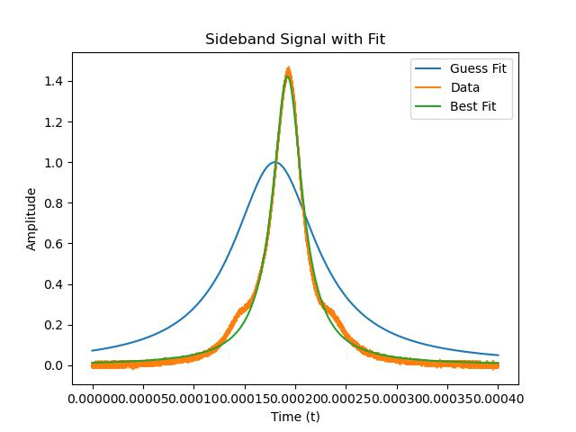
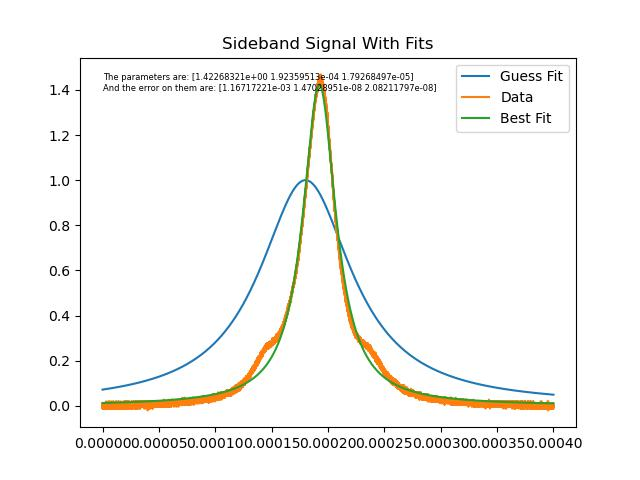
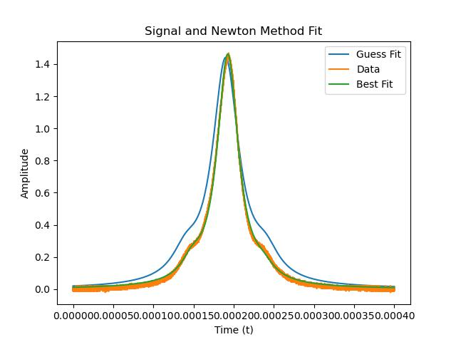

# Assignment 4

By Christian Mauffette Denis

For PHYS-512

## Question 1

### Part a)

To answer this question, we start by loading the data. We then define a function for the Lorentz fit that also returns the derivatives of the function with respect to the different parameters (the gradient).

We try to find the best parameters using Newton's method, which consists in linearizing the "$\Chi^2$ surface" to second order and then finding a step size that will get us closer to the minimum of the $\Chi^2$ function. We apply this procedure as long as the change in $\Chi^2$ between two steps is bigger than 0.01, which is a somewhat arbitrary decision. We could have stopped at 1 probably but since it doesn't require much more effort, why not?

We used as initial guesses $a=1$, $t_0 = 0.00018$ and $w=0.00005$. Our final fit values were found to be

`[1.42268321e+00 1.92359513e-04 1.79268497e-05]`

Respectively for $a$, $t_0$ and $w$. We can also plot the resulting curve:



The match appears pretty good, although the bumps are definitely not accounted for by the single Lorentzian.

### Part b)

To estimate the noise, we use the relatively flat tails of the function. Specifically, we used the right tail and cut off the furthest 100 data points. We obtained a noise of about `0.005`.

We can see the results in the following plot, with the best-fit parameters and their errors. These are listed in the order $a$, $t_0$ and $w$.



### Part c)

Our answers in **c** are not statistically significantly different from the answers in **a**. They all fall well within the error margin found in **a**. I know this is not a very quantitative argument, but: I can't even see the difference between most of the parameters' values which means that they are the same up to at least 8 significant figures, so really close. This also makes some decent sense considering that we used a two sided derivative which does a decent job.

The resulting parameter values and the associated plot is as follows.


### Part d)

We repeat the same procedure from part c), but we use the given model, with three Lorentzians. By graphical trial and error, we found some decent estimates for the parameters: $a = 1.4$, $t_0=0.00019$, $w=0.00002$, $b=0.15$, $c=0.15$ and $dt=0.00005$. We obtain the following plot with the best fit curve:



The outputted result (with the parameters in the same order as described before):

```code
The parameters are: [1.44301421e+00 1.92576200e-04 1.60607936e-05 1.03953867e-01
 6.49588141e-02 4.45065423e-05]
And the error on them are: [1.26692059e-03 1.50194459e-08 2.68683914e-08 1.20829861e-03
 1.18308416e-03 1.80801379e-07]
 ```

These errors are about 3 orders of magnitude smaller than their associated parameter values.

### Part e)

If we look at the residuals for the data and the beat fit, we clearly see some structure in there.


The first noticeable thing is that there are some "saw-tooth" in the data. At first I thought that this was coming from taking the derivative rather crudely but the fitting function is too smooth for these artifacts to occur. Hence I suppose that it must be coming from the data. Maybe some sort of aliasing or ramping could be to blame.

The second thing that's noticeable is that, at the center there are a lot of "wiggles". If I'm not mistaken, usually this comes from peaks being not centered properly on the data's peaks. This seems to suggest either that we, for some reason, are not at the correct parameter values (perhaps we're at the wrong minimum of the $\Chi^2$) or that the model simply does not describe the data well enough. Maybe we would get something better with a Gaussian? Or fitting with more peaks?

### Part f)

In this part we generated different realizations of the $\Chi^2$ given perturbations of the initial parameters. We obtain outputs of the likes of:

```output
Alternative fit 1  Chi^2 difference: 1.8524668897282481
Alternative fit 2  Chi^2 difference: 5.319222928700583
Alternative fit 3  Chi^2 difference: 1.0541127803985546
Alternative fit 4  Chi^2 difference: -2.4109559466214705
Alternative fit 5  Chi^2 difference: 6.368051027757247
Alternative fit 6  Chi^2 difference: 3.194188949971476
Alternative fit 7  Chi^2 difference: -0.5599786740458512
Alternative fit 8  Chi^2 difference: -2.0405841538515688
Alternative fit 9  Chi^2 difference: -4.093283780098091
Alternative fit 10  Chi^2 difference: 1.6749483074559066
Mean difference in Chi^2: 1.0358188329395035
```

We can also see the different realizations on the following plot:


This was done by generating a random perturbation with magnitude and correlation between parameter perturbation based on the covariance matrix. For each of these random generations we simply added them to the best fit parameters and computed the difference in $\Chi^2$ as well as plotted the result.

The resulting variation in $\Chi^2$ is of order unity. I would have expected to be closer to 1, however we often get results a bit bigger. When running this procedure 20 000 times, we obtained a mean $\Chi^2$ difference of about 1.60. I have difficulty explaining where this value comes from. My intuition says it would converge towards 1, but numerically, it doesn't look like it's the case.

Anyhow, a difference of 1 is definitely not significant, therefore: **yes** it is reasonable.

### Part g)

For the MCMC version of the same fitting problem we obtain results similar to:

```output
The best fit parameters are: [1.44069983e+00 1.92611012e-04 1.61603381e-05 1.02895450e-01
 6.11206779e-02 4.44680841e-05]
Their error is: [2.25844235e-03 2.77280794e-08 4.79590333e-08 2.78745860e-03
 2.14455503e-03 3.88338719e-07]
With Chi^2: 1678.291346589708
```

again, this is respective to parameters in the same order as before.


### Part h)
