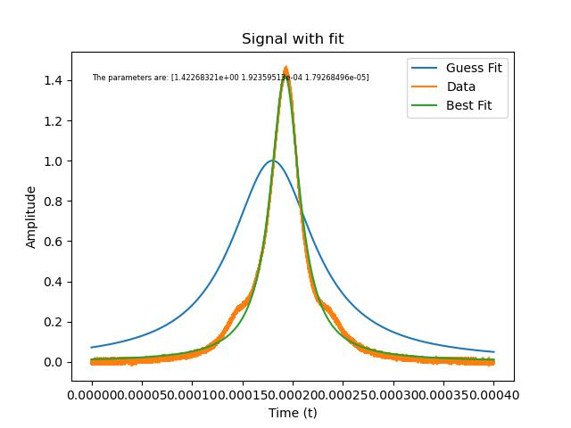

# Assignment 4

By Christian Mauffette Denis

For PHYS-512

## Question 1

### Part a)

To answer this question, we start by loading the data. We then define a function for the Lorentz fit that also returns the derivatives of the function with respect to the different parameters (the gradient).

We try to find the best parameters using Newton's method, which consists in linearizing the "$\Chi^2$ surface" to second order and then finding a step size that will get us closer to the minimum of the $\Chi^2$ function. We apply this procedure as long as the change in $\Chi^2$ between two steps is bigger than 0.01, which is a somewhat arbitrary decision. We could have stopped at 1 probably but since it doesn't require much more effort, why not?

We used as initial guesses $a=1$, $t_0 = 0.00018$ and $w=0.00005$. Our final fit values were found to be

`[1.42268321e+00 1.92359513e-04 1.79268497e-05]`

Respectively for $a$, $t_0$ and $w$. We can also plot the resulting curve:

The match appears pretty good, although the bumps are definitely not accounted for by the single Lorentzian.

### Part b)

To estimate the noise, we use the relatively flat tails of the function. Specifically, we used the right tail and cut off the furthest 100 data points. We obtained a noise of about `0.005`.

We can see the results in the following plot, with the best-fit parameters and their errors. These are listed in the order $a$, $t_0$ and $w$.

### Part c)

Our answers in **c** are not statistically significantly different from the answers in **a**. They all fall well within the error margin found in **a**. I know this is not a very quantitative argument, but: I can't even see the difference between most of the parameters' values which means that they are the same up to at least 8 significant figures, so really close. This also makes some decent sense considering that we used a two sided derivative which does a decent job.

The resulting parameter values and the associated plot is as follows.

### Part d)

### Part e)

If we look at the residuals for the data and the beat fit, we clearly see some structure in there.

The first noticeable thing is that there are some "saw-tooth" in the data. At first I thought that this was coming from taking the derivative rather crudely but the fitting function is too smooth for these artifacts to occur. Hence I suppose that it must be coming from the data.

### Part f)

### Part g)
