# Assignment 5

By Christian Mauffette Denis

For PHYS-512

## Question 1

(This question is coded in `a5q1_chi.py`)

If we use the given parameters:

$$
\begin{cases}
H_0 = 69\\
\Omega_b h^2 = 0.022\\
\Omega_c h^2 = 0.12\\
\tau = 0.06\\
A_s = 2.1e-9\\
n_s = 0.95
\end{cases}
$$

The resulting $\Chi^2$ is `3272.20`. Because of the number of data points and the number of variables, we have the expected value for our $\Chi^2$: $2501 \pm 70$. The obtained value does not fall within the error bounds in fact it is more than 10$\sigma$ away from it. Hence, it is not an acceptable fit.

## Question 2

(To answer this question, we've used the file `a5q3_newton.py`.)

For this question we simply apply the newton method multiple times. When doing so, we get closer to a minimized $\Chi^2$ value. However, when we get pretty close to the value, for reasons not clear to me, we sometimes get slight increases in the value of the $\Chi^2$. I am not sure if this is a bug or if this is normal. After seeing other people's code, it seems that this is somewhat normal behavior. However, I would not have expected this to happen before seeing it in action.

From this method, we get parameters yielding a $\Chi^2$ of around 2579 or under. Since the parameters jump up and down as we get close to the minimum, we don't have an optimal value, but only values close to it. One of these is

$$
\begin{cases}
H_0 = 68 \pm 1\\
\Omega_b h^2 = 2.22e-02\pm 3e-04\\
\Omega_c h^2 = 1.18e-01 \pm 2e-03\\
\tau = 6e-02\pm5e-02\\
A_s = 2.1e-09 \pm 2e-10\\
n_s = 9.7e-01 \pm 1e-02
\end{cases}
$$

With $\Chi^2 = $.

We store the optimized values and covariance matrix on the HDD for further use with our MCMC in the next question.

## Question 3

For this question we can run a run using `a5q3.py`, but instead of running only 1 shot runs, we made a script that allows to "continue" the runs by using the last parameters of the last run. This is done using `a5q3_continuous.py`. We can fuse all those results by joining them together using the script `a5q3_compile.py`. When running this for about 35000 MCMC steps, we obtain the following corner plot:

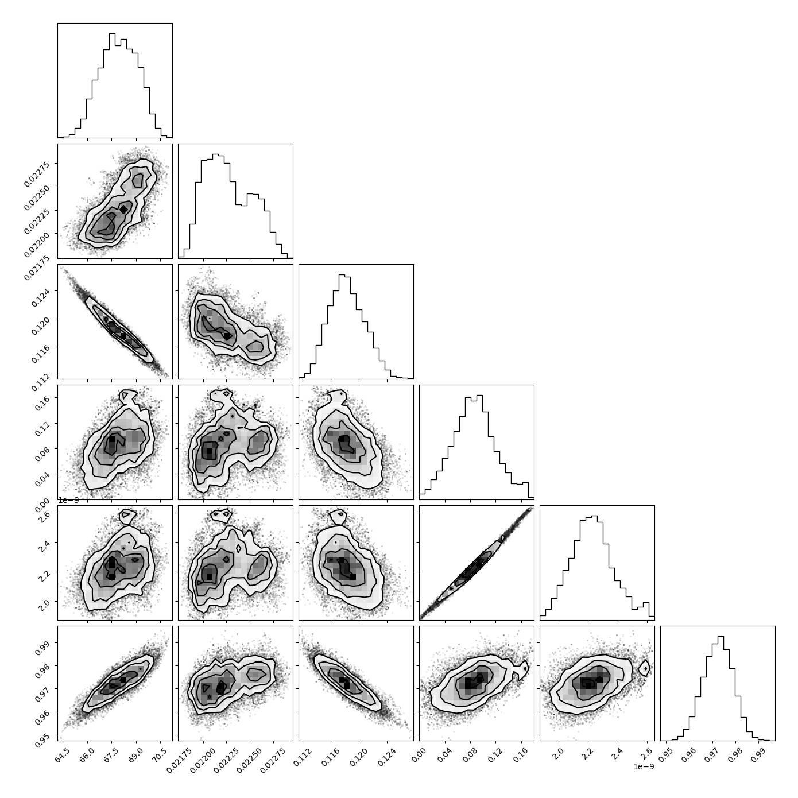

Based on this corner plot, it looks like our chain is doing pretty well. There is a clear delimiting of what appears to be the optimal $\Chi^2$ value. No weird patterns are seen. We should not that some of the parameters are very correlated namely $\Omega_c h^2$ and $H_0$. As well as $\tau$ and $A_s$. We see this by seeing how stretch the "ellipse" is. The $\Chi^2$ "bottom" does not appear to behave too weirdly. Aside from important stretchings, it looks more or less elliptical.

To discuss convergence better, we look at the different runs from the simulation.

### $H_0$

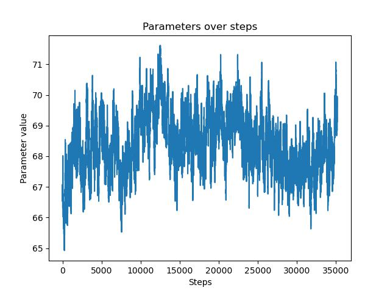
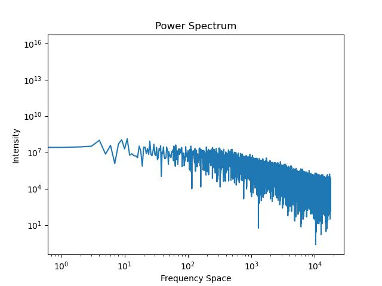

### $\Omega_b h$

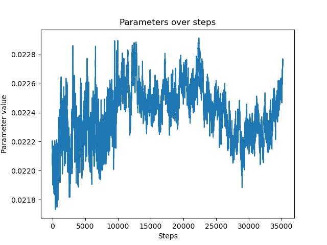
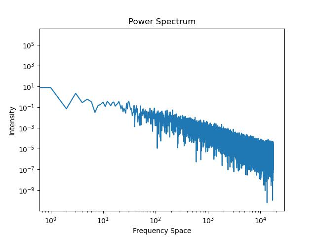

### $\Omega_c h$

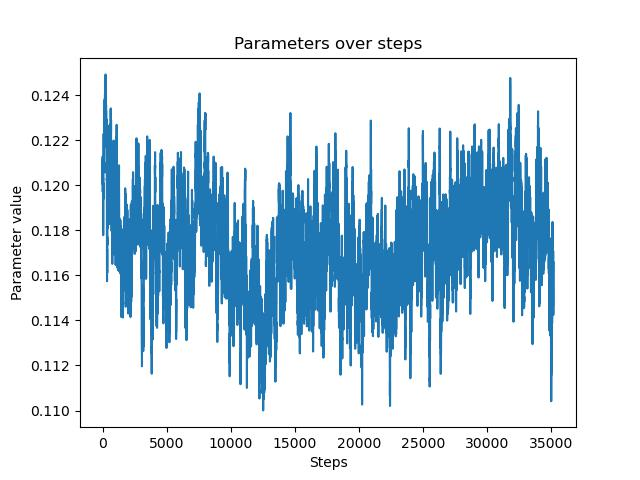
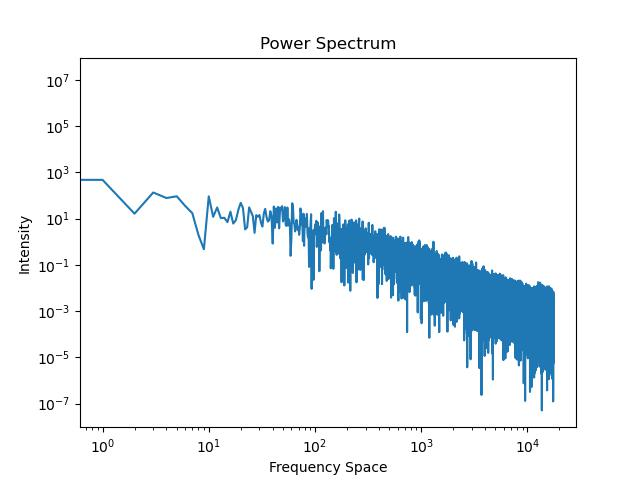

### $\tau$

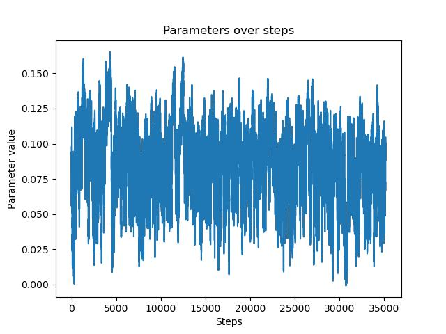
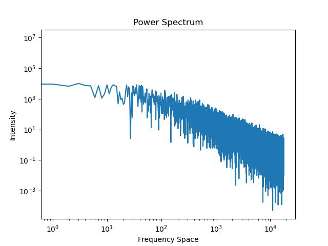

### $A_s$

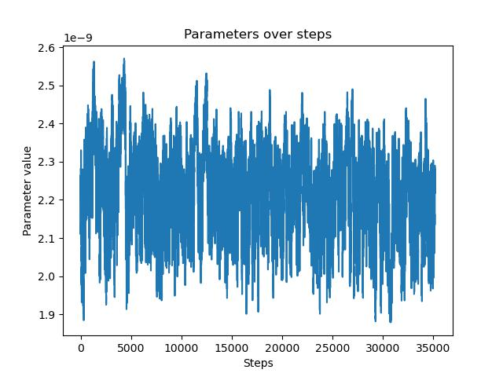
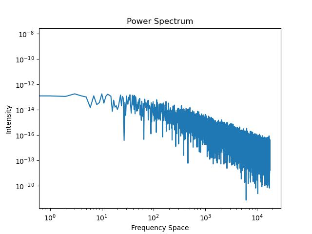

### $n_s$

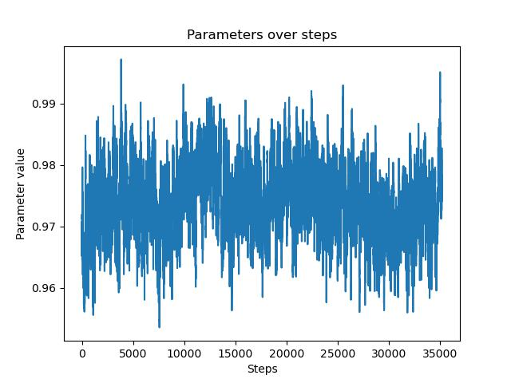
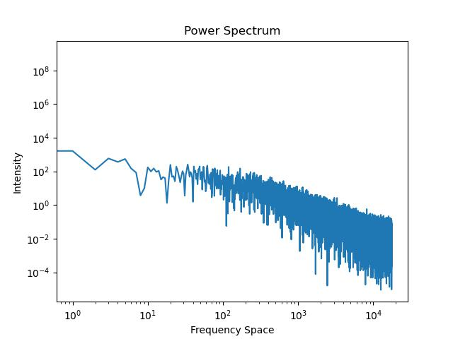

Looking at the power spectrum for each chain, it appears that chain has indeed converged, due to the high frequency decay. Some seem to have converged better than others. We can see that the run for $\tau$ and $A_s$, for example, look like solid blocks of white noise. We should also point out, that since our initial guess was so close to the optimal $\Chi^2$ value, we have virtually no burn in period.

Based on this simulation the parameters obtained are:

$$
\begin{cases}
H_0 = 68.5 \pm 0.9\\
\Omega_b h^2 = 2.24e-02\pm 2e-04\\
\Omega_c h^2 = 1.17e-01 \pm 2e-03\\
\tau = 8e-02\pm3e-02\\
A_s = 2.2e-09 \pm 1e-10\\
n_s = 9.74e-01 \pm 6e-03
\end{cases}
$$

with a $\Chi^2$ for the mean value of 2576.92.

Given the information in the question, I'm assuming that

$$\Omega_\Nu = 1 - \Omega_c - \Omega_b$$

Hence, we can find $\Omega_\Nu$ being: $-3.19e65\pm5e63$. This is very large in magnitude. I am very unsure if this is correct. However, in class we were told that dark energy occupies a great portion of the total energy in the univers, therefore, maybe such a large number is indeed correct. Maybe this is off by some conversion factor, or I made a mistake in calculating it giving a way too large magnitude (as can often be the case when using Planck's constant.)

## Question 4

For this question, I do it in two parts, first running a new chain using the given constraints, this is done in `a5q4_pt1.py` and in the `continuous` and `compile` files following the same process that was explained in the previous question.

If we run the new chain using the given constraint, we have:

### $H_0$

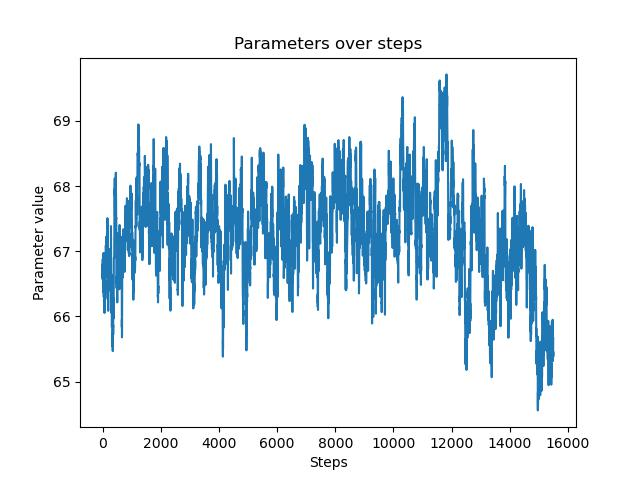
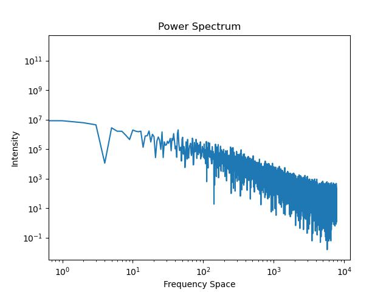

### $\Omega_b h$

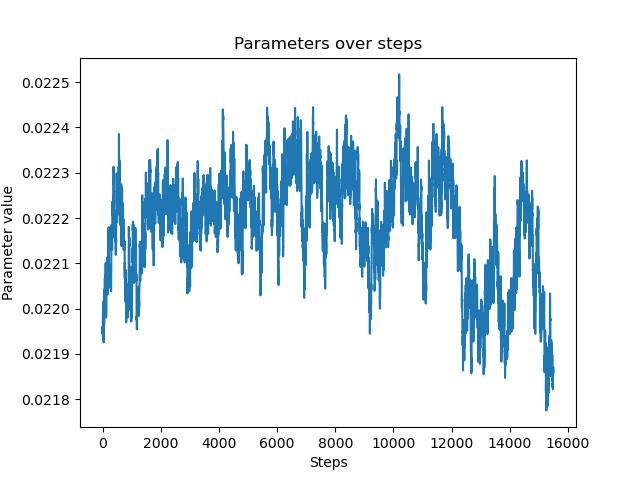
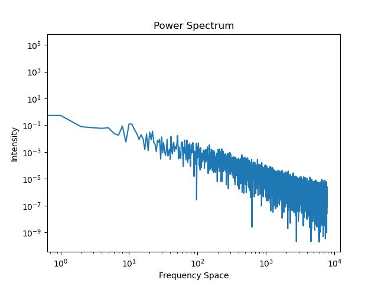

### $\Omega_c h$

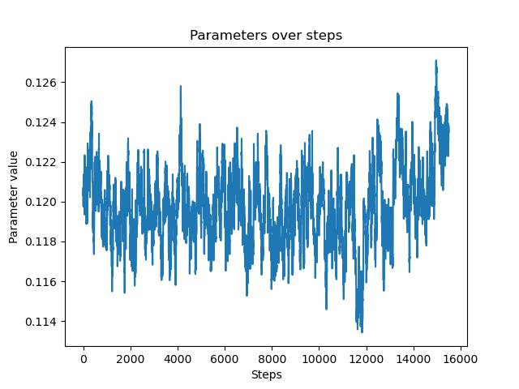
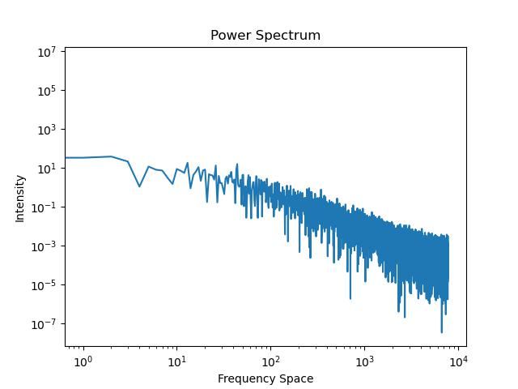

### $\tau$

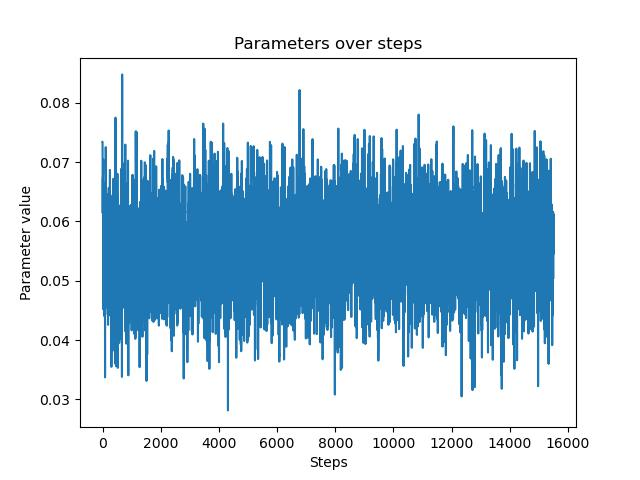
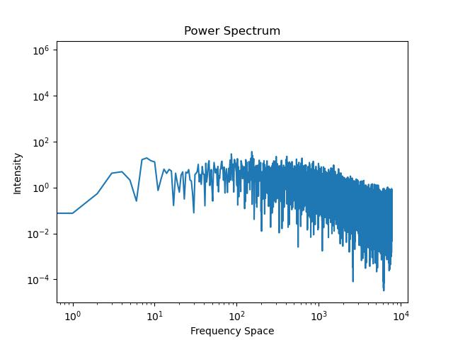

### $A_s$

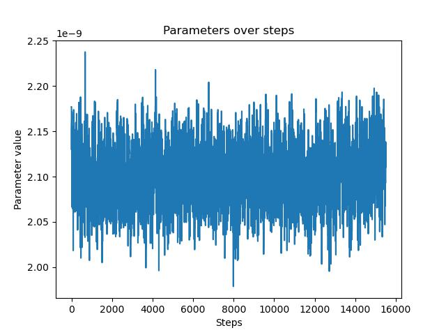
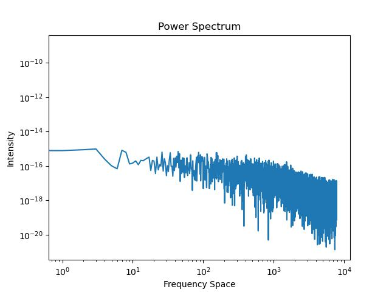

### $n_s$

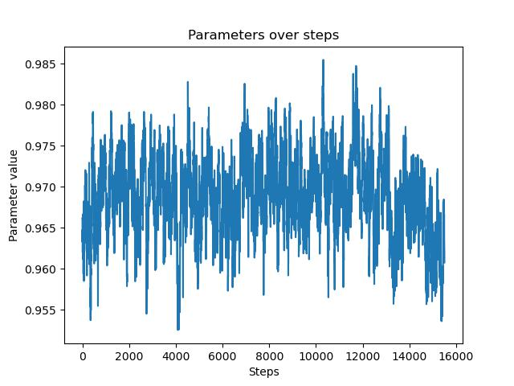
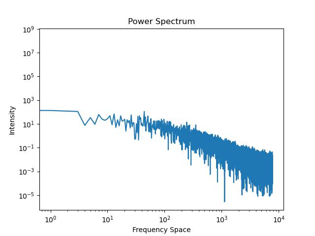

For the same reasons described in Q3, it seems like these chains have converged. We also obtained some corner plots for this chain. It seems like there is some skewing with the samples that was not present originally. Either this comes from a bad implementation of the simulation aka a bug or is a natural feature of the simulation (I would be leaning towards the former).

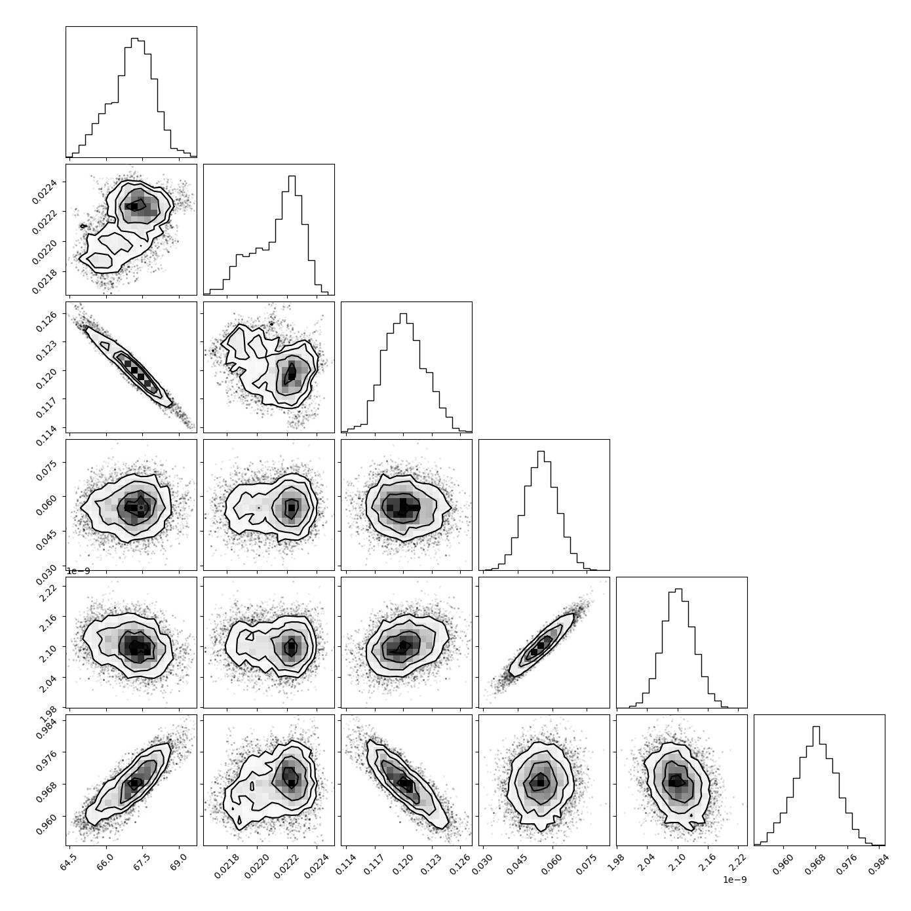

The obtained parameters are:

$$
\begin{cases}
H_0 = 67.2 \pm 0.8\\
\Omega_b h^2 = 2.22e-02\pm 2e-04\\
\Omega_c h^2 = 1.20e-01 \pm 2e-03\\
\tau = 5.5e-02\pm7e-3\\
A_s = 2.1e-09 \pm 3e-11\\
n_s = 4.89e-01 \pm 5e-03
\end{cases}
$$

When comparing these with the result from importance sampling, we do not get a match... I would've thought that we should get similar values. Importance sampling yields (where the parameters are in the same order as before):

```output
[7.03752089e+01, 2.25663501e-02, 1.12731201e-01, 1.13895550e-01, 2.32276883e-09, 9.84511935e-01]
```

It seems importance sampling overshot the parameters' values. I am not sure why.

To perform importance sampling, we have attributed a weight, while doing an average, to all the elements of our chain based on how far the sample was from the given mean for $\tau$. The weight was computed using a gaussian distribution centered at 0.054 with standard deviation 0.0074. For each samples the resulting value from the gaussian was assigned and taken into account in the averaging. This means that samples with a value of $\tau$ closer to 0.054 are taken with greater weight than samples further away from that mean. I would've thought that these two methods (modifying the $\Chi^2$ and importance sampling) would've yielded similar result, but they do not. I feel this might be coming from a problem in my code. Perhaps it comes from the new chain since, it looks like more things could go wrong there.
