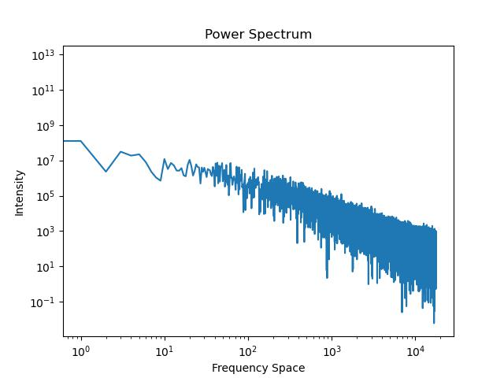

# Assignment 5

By Christian Mauffette Denis

For PHYS-512

## Question 1

(This question is coded in `a5q1_chi.py`)

If we use the given parameters: 

$$
\begin{cases}
H_0 = 69\\
\Omega_b h^2 = 0.022\\
\Omega_c h^2 = 0.12\\
\tau = 0.06\\
A_s = 2.1e-9\\
n_s = 0.95
\end{cases}
$$

The resulting $\Chi^2$ is `3272.20`. Because of the number of data points and the number of variables, we have the expected value for our $\Chi^2$: $2501 \pm 70$. The obtained value does not fall within the error bounds in fact it is more than 10$\sigma$ away from it. Hence, it is not an acceptable fit.

## Question 2

(To answer this question, we've used the file `a5q3_newton.py`.)

For this question we simply apply the newton method multiple times. When doing so, we get closer to a minimized $\Chi^2$ value. However, when we get pretty close to the value, for reasons not clear to me, we sometimes get slight increases in the value of the $\Chi^2$. I am not sure if this is a bug or if this is normal. After seeing other people's code, it seems that this is somewhat normal behavior. However, I would not have expected this to happen before seeing it in action.

From this method, we get parameters yielding a $\Chi^2$ of around 2579 or under. Since the parameters jump up and down as we get close to the minimum, we don't have an optimal value, but only values close to it. One of these is 

$$
\begin{cases}
H_0 = 68 \pm 1\\
\Omega_b h^2 = 2.22e-02\pm 3e-04\\
\Omega_c h^2 = 1.18e-01 \pm 2e-03\\
\tau = 6e-02\pm5e-02\\
A_s = 2.1e-09 \pm 2e-10\\
n_s = 9.7e-01 \pm 1e-02
\end{cases}
$$

With $\Chi^2 = $.

We store the optimized values and covariance matrix on the HDD for further use with our MCMC in the next question.

## Question 3

For this question we can run a run using `a5q3.py`, but instead of running only 1 shot runs, we made a script that allows to "continue" the runs by using the last parameters of the last run. This is done using `a5q3_continuous.py`. We can fuse all those results by joining them together using the script `a5q3_compile.py`. When running this for about 35000 MCMC steps, we obtain the following corner plot:

Based on this corner plot, it looks like our chain is doing pretty well. There is a clear delimiting of what appears to be the optimal $\Chi^2$ value. No weird patterns are seen. We should not that some of the parameters are very correlated namely $\Omega_c h^2$ and $H_0$. As well as $\tau$ and $A_s$. We see this by seeing how stretch the "ellipse" is. The $\Chi^2$ "bottom" does not appear to behave too weirdly. Aside from important stretchings, it looks more or less elliptical.

To discuss convergence better, we look at the different runs from the simulation.

### $H_0$

### $\Omega_b h$

### $\Omega_c h$

### $\tau$

### $A_s$

### $n_s$

## Question 4

