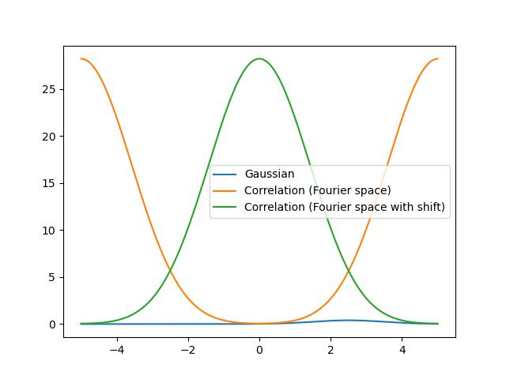
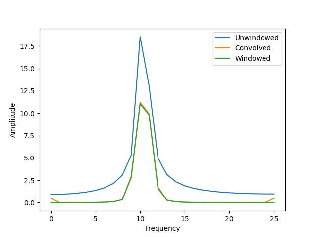
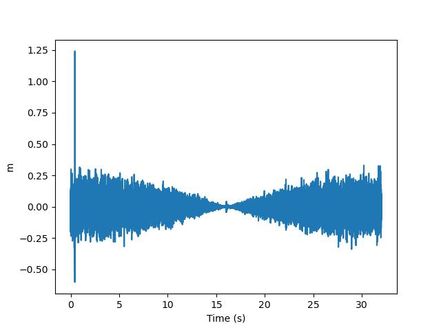

# Assignment 6

## Question 1

We can use a Dirac function with a convolution to shift a signal around. More precisely, we know that

$$ f(t-k)=f(t) \circledast \delta(t-k) $$

Hence, using this property, we can make a function that simply convolves an array with a shifted dirac. In this case, we have the `shift` argument which corresponds to a shift in the array's index:

```python
def convo_shift(x, shift):
    dirac = np.zeros(len(x))

    dirac[int(len(x)/2)+shift] = 1

    return np.convolve(x, dirac, 'same')
```

The function works by creating an array of the same length as the input array, then adds the dirac's peak at a position shifted from the center by the inputted amount. Then these two arrays are convolved with each other and returned.

We can see this in action, by shifting a gaussian, by 200 in the following:


## Question 2

### Part a)

We can apply the given theorem to create a correlation using fourier space. This is done using the following code:

```python
def cor_func(a, b, shift = False):
    if not shift:
        return np.fft.ifft(np.fft.fft(a) * np.conjugate(np.fft.fft(b)))
    if shift:
        return np.fft.fftshift(np.fft.ifft(np.fft.fft(a) * np.conjugate(np.fft.fft(b))))
```

This code simply takes the discrete FFTs and IFFTs of the arrays `a` and `b` and outputs the resulting correlation. We added an extra argument to allow to use the `fftshift` method so as to recenter the peak. We can see in the following figure that we obtain a Gaussian in our Fourier space:


Notice that we also plotted the reshifted Gaussian.

### Part b)

When shifting the Gaussian, the fourier space result ends up looking the same (up to a phase).



We can see the shifted Gaussian and the unchanged Fourier space function (up to a phase). This is because, in fourier space, the math basically "wraps" the array around.

## Question 3

To bypass the wrap-around nature of the FFT, we can define/add zeroes to the end of our arrays/data. A code like this works:

```python
def convo(a, b):
    # Adding zeros to the end
    nb_zer = len(a)
    zers = np.zeros(nb_zer)
    a_zer = np.concatenate([a, zers])
    b_zer = np.concatenate([b, zers])

    # Taking the rFFT and then converting back into position space
    return np.fft.irfft(np.fft.rfft(a_zer) * np.conjugate(np.fft.rfft(b_zer)))[:nb_zer]
```

When doing a convolution in Fourier space, we can think of it as having two rings each containing the elements of our arrays and putting the two rings side by side. We then multiply every element on a ring by the paired one on the other and add all of these products. We then shift one ring by one index relative to the other and repeat. The summation of all the products for all the possible rotations of the ring will create the convolution array. The problem with this is that there is no "end" to the ring and it keeps being matched with other values. What we can do to fix this is simply add as many zeros as there are elements in the arrays to the rings and then remove that same amount to the final array. This will make sure that there is no "cross-talk" between the rear elements of the first array with the front elements of the second array. Sorry for the wordiness, hopefully the code is clearer than my explanation lol

## Question 4

### Part a)

We know that for geometric series we have:

$$ 
\sum_{k=0}^{n-1} a x^k = \begin{cases}
a \left(\frac{1 - x^n}{1-x}\right)n
, \ x\neq1\\
an, \ x = 1
\end{cases}
$$

In our case we have the sum:

$$\sum_{x=0}^{N-1}\exp\left(-\frac{2\pi ik x}{N}\right)$$

Consequently, reading off the terms in the equation we can substitute in the result from the geometric series. :

$$\sum_{x=0}^{N-1}\exp\left(-\frac{2\pi ik x}{N}\right) = \sum_{k=0}^{N-1}  \exp\left(-\frac{2\pi i k}{N}\right)^x = \left(\frac{1 - \exp\left(-\frac{2\pi i k}{N}\right)^{N}}{1-\exp\left(-\frac{2\pi i k}{N}\right)}\right)$$

$$= \left(\frac{1 - \exp\left(-2\pi i k\right)}{1-\exp\left(-\frac{2\pi i k}{N}\right)}\right)$$

This holds for

$$ \exp\left(-\frac{2\pi ik }{N}\right) \neq 1$$

and when

$$ \exp\left(-\frac{2\pi ik }{N}\right) = 1$$

we have

$$\sum_{x=0}^{N-1}\exp\left(-\frac{2\pi ik x}{N}\right) = N$$

### Part b)

Using the previous result, we see that when $k\to 0$, we have

$$ \exp\left(-\frac{2\pi ik }{N}\right) = 1$$

hence, we have 

$$\sum_{x=0}^{N-1}\exp\left(-\frac{2\pi ik x}{N}\right) = N.$$

Furthermore, if we have an integer k that is not a multiple of N, then we have 

$$\exp\left(-2\pi i k\right)=1$$

on top and some value $\neq 0$ on the bottom. Hence we get

$$\left(\frac{1 - \exp\left(-\frac{2\pi i k}{N}\right)^{N}}{1-\exp\left(-\frac{2\pi i k}{N}\right)}\right) = \left(\frac{0}{1-\exp\left(-\frac{2\pi i k}{N}\right)}\right)=0$$

$$:)$$

### Part c)

We can plot the analytical spectrum for the FFT of a sine wave with a non-integer frequency, in this case 10.4. In the following plot, we plot both the numerical and analytical results:


We clearly see that the numerical result features some "spectral leaking" on the side of its peaks.

### Part d)

For this part we use the given cosine windowing function. We simply multiply the time data by it and then look at its fourier spectrum. We get the following


Indeed we see that the spectral leakage drops dramtically for the windowd function.

### Part e)

If we take the Fourier transform of the cosine window, we obtain the following:


If we print out the result we can see that this is indeed an array of the form $[N/2, -N/4, 0, .., 0, -N/4]$. We should point out that actually in this case, the 0s are in fact small values, but not 0.

Now this means that if we do the convolution of the spectrum with this coupling amongst neighbors we can obtain the windowing, while only working in Fourier space. If we do this and compare with our previous results using a multiplication with a window function, we get:



We see that indeed, this convolution does produce the same results as the windowing. The small differences are most likely due to the fact that we used exactly 0s in the convolution, but should've used something a bit bigger than 0.

## Question 5

### Part a)

To model the noise we smooth out the data using a convolution with a fat gaussian. This basically averages out neighboring points. Practically this is done using Jon's code:

```python
def smooth_vector(vec,sig):
    n = len(vec)                               
    x = np.arange(n)                          
    x[n//2:] = x[n//2:]-n                       # Axis
    kernel = np.exp(-0.5*x**2/sig**2)           # Gaussian to convolve
    kernel = kernel/kernel.sum()                # Normalize Gaussian
    vecft = np.fft.rfft(vec)                    # FFT of array
    kernelft = np.fft.rfft(kernel)              # FFT of gaussian
    vec_smooth = np.fft.irfft(vecft*kernelft)   # convolve the data with the kernel
    return vec_smooth
```

 We can see this effect in the following picture:


The orange curve is the smoothed data in Fourier space and the blue curve is the raw data in Fourier space. The raw time-domain data was put in Fourier space using a cosine windowing to prevent artefact in the frequency domain. After playing with this and being able to find a peak for the GW event, I didn't find useful to use an alternate windowing scheme. Maybe there was some noise reduction in some of the options I tried, but I did not notice anything significant, hence I decided to only use the cosine window.

Using this smoothed out curve, we can now whiten the data. Intuitively, we want to flatten out to frequency response to make it closer to white noise. To do this, we can simply divide the raw Fourier spectrum by the smoothed out version. We could have used a simple curve to do this, but I didn't think it would be worth it since we already have a relatively smooth result, which is adaptive. It means less manual tweaking of parameters in our curve or trying to curve fit to the data. The method used does indeed flatten/whiten out our spectrum as shown in the following plot:


We indeed see the power spectrum being flattened, except possibly for the very begining. This is not really a problem since that range (on a log scale) does not represent many points in comparison to the rest of the points and also it is not in the range where our sought-after signal exists. We will actually filter out a portion of the spectrum. In the JSON data, we see that all of our events exist in between 10 and 1000 Hz. Hence, we will look only at frequencies within this range.

### Part b) 

For this part we essentially loop over the different events and read off the JSON data what is the associated files for

1. The Livingston detector
2. The Hanford detector
3. The template file

Using these, we then proceed, as described previously to filter the data by applying a band pass in the region of 10 to 1000 Hz, we also whiten the data by dividing the raw signals spectrum by a smoothened version of the same spectrum. This is shown in the following plot:


With this, we can now apply a match filtering with our template in Fourier space. Converting back to the time domain, we obtain plots like the following for each detector:



We see a peak closeby to the 0 s mark. The found position of the peaks for each events are:

```output
GW150914: 
    Hanford: 0.4404296875
    Livingston: 0.43310546875

LVT151012:
    Hanford: 0.44140625
    Livingston: 0.4417724609375

GW151226
    Hanford: 0.647705078125
    Livingston: 0.646484375

GW170104
    Hanford: 0.60791015625
    Livingston: 0.6109619140625
```


### Part c)

We can find the SNR using the following formula:

$$\text{SNR} = \frac{\text{max}(x^2)}{\text{mean}(x^2)}$$

and we use what I found online to be called "Equal Gain Combining" to combine SNR of two signals. This is defined as

$$\text{SNR}_{\text{tot}} = \frac{1}{2}\left(\text{SNR}_{\text{1}}^{1/2} + \text{SNR}_{\text{2}}^{1/2} \right)^2$$

For each event we then get:

```output
GW150914: 
    Hanford: 7.31552905495105
    Livingston: 12.34747389416139
    Combined: 19.33562184563671

LVT151012:
    Hanford: 35.959162405388376
    Livingston: 37.79704234863802
    Combined: 73.74475376085898

GW151226
    Hanford: 142.4517221517886
    Livingston: 281.1151785130941
    Combined: 411.89677148372743

GW170104
    Hanford: 41.19736083269106
    Livingston: 21.691491618581157
    Combined: 61.3381079528838
```

We seem to get pretty decent SNRs for some of the events, others are not as good. An interesting remark is that the Livingston detector consistently has larger SNR than Hanford. I'm not familiar with the surroundings of Hanford, but it makes sense that if one station has the same noisy characteristics, then they are preserved accross the events.

### Part d)

Using the results from part c), I tried to compare it to the analytic SNR. I am very confident I failed in my attempt. I tried computing the noise analytically using

$$\text{noise} = \left(A^T N^{-1} A\right)^{-1/2}$$

(Line `104` in `a6q5d.py`) I obtain a ridiculously small SNR of the order of $10^{-30}$. I suspect this is not normal. Had this worked, I would think that the analytical noise would be larger then the measured noise.

### Part e)

If we look at the spectrum of the whitened data, the template and the convolution, we get the following plot:


We can see that most of the weight come from a frequency range between about 10 and 800 Hz. Hence the frequency in between these two delimiters is about 405 Hz.

### Part f)

If we look at a zoomed up version of the detected signal in the time domain we see the following:


