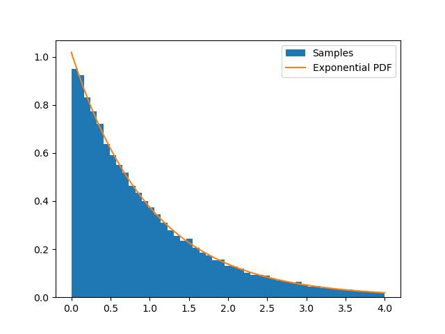

# Assignment 7

By Christian Denis
For PHYS-512

## Question 1

Looking at the random numbers from the `.txt` file it's clear that we are in presence of a problematic number generator to say the least...


The previous figure is a cross section of the data scattered in 3D. With an appropriate rotation we can clearly see the lines not being randomly distributed (about 30 indeed).

If we try to do the same in python, I did not manage to obtain a similar result with the PRNG from numpy.


Even after rotating it and playing with it for a while, I could not see any weird non-random pattern by eye. I guess that's the problem, perhaps the flaw in this specific PRNG is not as obvious, so if it ever fails, it'll most likely do so in an unpredictable way...

I tried generating the random numbers on my own machine. I was able to generate some and plot them, but was not able to see the same pattern...


I suspect this is because of the scale I was using, but for some reason I was not able to select values below $10^8$ using Jon's code. I even tried modifying it to make it work, but nothing worked well. It's as if the number generator generated no three values below a certain point. This seems odd, but since I'm using the generator as some kind of black box it's difficult to tell what is going on. It's possible that the generator was updated and I am using this version on my machine, otherwise, it might just be a scale problem.

## Question 2

First I have to find a way to generate the distribution that were assuming we know how to generate. To to so, I use a rejection method, but using a recursive function that works like the following:

```python
# Using a recursive function
def cauchy_rand():
    # Generating 2 random numbers
    r = np.random.rand(2)*4
    r[0] = r[0]
    # Check if they are accepted, else try again recursively
    if r[1] < cauchy(r[0])*np.pi/4:
        return r[0]
    else:
        return cauchy_rand()
```

What we want is the distribution that will be the closest to the distribution we want to obtain (without ever crossing in the region of interest). In other words, we want to minimize the area between the bounding distribution and the "goal distribution". If we look at different possible distributions we have:


The curve we want to "imitate" is the blue one. The Gaussian one is not really suitable since it decays too quickly, and there will always be a point where the curves cross. The Cauchy and exponential do a pretty good job, but in the large $x$ state, Cauchy is closer. Hence I'll pick that one.

Let's test out our code to make a cauchy distribution. We indeed get a Cauchy distribution here:


Using this, we can call this function inside a vectorized generator:

```python
def rand_exp(n):
    # Returns distribution with exponential distribution
    
    # Compute two random numbers
    r1 = np.random.rand(n)*4
    r2 = np.array([cauchy_rand() for i in range(n)])

    # Test to see if samples are accepted
    accept = r1 < expo(r2)/cauchy(r2)

    return r2[accept]
```

Inside the function, we create two arrays of random numbers with length `n`. The first is uniformly distributed, the second is distirbuted according to a cauchy distribution.

We then compare the values of the uniformly distributed array to the values of the Cauchy array when they are put into the function

$$f(x)=\frac{f_{\text{Exponential}}(x)}{f_{\text{Cauchy}}(x)M}.$$

In this case $M=1$ since $f_{\text{Cauchy}}(x) \geq f_{\text{Exponential}}(x)$ for all $x$. This produces a Boolean array which we can use to select the values of the Cauchy distributed array which will "pass through" and will be distributed according to the exponential.

We can indeed see that the distribution matches the exponential quite well:


We get a rejection rate of around 80%. The actual number is around 90%, since we generate two numbers at each trial. We could've gotten a better acceptance rate had we chosen a distribution closer to the one we wanted to imitate. This is not always easily doable because being able to sample from an arbitrary distribution is the point of this method in the first place.

## Question 3

We consider the distribution

$$p(x)=e^{-x}$$

We want to produce random samples distributed according to $p$. We use the "ratio of uniforms" method to do so. To that end we must find what are the minima and maxima of the random variables $u$ and $v$. We know that we have the relationship

$$ 0 \leq u \leq \sqrt{p\left(\frac{v}{u}\right)} = \sqrt{e^{-\frac{v}{u}}}$$

Hence, for v,
we have

$$ \log u \leq  -\frac{v}{2u}$$

$$ v \leq  -u \log u^2$$

Hence we have

$$ 0 \leq v \leq  -u \log u^2$$

The maximum value of $-u \log u^2$ occurs at:

$$\frac{d}{du}\left(-u \log u^2\right)= -\log \left(u^2\right)-2$$

Setting to 0, we have

$$-\log \left(u^2\right)-2=0$$

$$\implies u = \frac{1}{e}$$

This means that

$$ 0 \leq v \leq  \frac{2}{e}$$

Furthermore, we can graphically see that

$$ 0 \leq u \leq 1$$

before the function starts becoming negative.

Our bounds are then

$$ 0 \leq v \leq  \frac{2}{e}$$
$$ 0 \leq u \leq 1$$

Hence we can now do some numerical work

```python
# Number of samples to try
n = 100000

# Define exponential
def exponential(x):
    return np.exp(-x)

# Generate two uniform distribution with proper scaling
u = np.random.rand(n)
v = np.random.rand(n)*2/np.e

# Generate accept array
accept = u <= np.sqrt(exponential(v/u))

# Select accepted values
values = (v/u)[accept]
```

This produces the following histogram:



We can see that indeed the samples match the expected distribution really well. Furthermore, we get an acceptance ratio of about 67%, which means, we get an efficiency of about ~33%, which is already much better than in our previous results with the rejection method.
