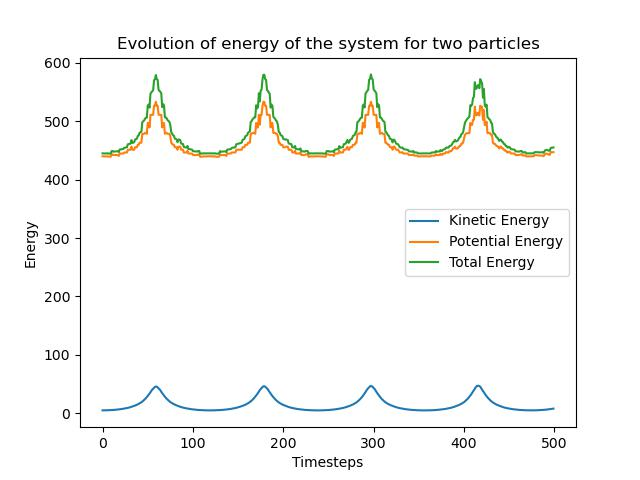

# Final Project

By Christian Denis for PHYS-512

## Part 1

Here we use an $n$-body simulation to show the behavior of a single free particle. This is more of a test than anything. Nothing too interesting is happening here.

We expect our particle to stay put, and indeed this is what is happening as demonstrated by this uneventful GIF.


Maybe there's some stuff happening on the smaller scale that is not displayed by the GIF however... Let's make a plot of the XY positions over time to see if there's stuff we're missing:


Looks pretty static.

## Part 2

Here we use the same $n$-body simulation to show two particles orbiting each other. This result is more interesting than the previous one, but is also sort of a test to make sure our simulation doesn't present any problems. The following GIF shows the simulation:


We see that the two particles are indeed in orbit.

An interesting observation we can make with this is the energy of the system at different points in time. If we plot the kinetic, potential and total energies of the system we get:



It appears as though the average energy is somewhat constant over the long term, however, it seems to be oscillating through the simulation, this is somewhat surprizing and I have a hard time coming up with an explanation...

It is worth pointing out that for smaller grid sizes there is one somewhat undesirable feature of the simulation is the fact that the particles keep drifting. I think this might be caused by the fact that the potential exists at the center of each cell in a grid which does not exactly correspond to the location of the particles, and this effect is more significant for larger cell sizes.

## Part 3

This part is computed in `3_per_vs_nonper.py`, using the `Particle` class defined in `particle_class.py`. The GIFs are generated using the script `make_gif.py`.

Here we simulate periodic and non-periodic systems of $n$ particles (here $n$ is 200000, in both cases).


We see that for the periodic case, clusters begin to form everywhere on the grid. For the non-periodic case, since the only force felt is towards the center of the grid, we see the particles collapse towards the center.

If we plot the total energy as a function of time, we obtain


For the periodic case, it looks like the total energy is somewhat flat. It increases at a stable state through the simulation. This is not the case for the non-periodic simulation. We see important spikes in the energy. I think these spikes arrize whenever the cluster collapses on itself. In the GIF we see the cluster sort of pulsating in a damped way. I would think that this energy misconservation might be coming from the fact that the particles are getting really close to each other and moving at appreciable velocities, thus end up "skipping over" the center of the potential. I would think that a similar mechanism holds to make the peak decrease as well.

## Part 4

For this part, we performed the same exact simulation (same initial conditions as well) as for the previous part, but using a RK4 integrator. The integrator looks like this:

```python
    def take_step_rk(self, dt=1):
        # Takes step using Runge-Kutta
        # using the second order derivative description here: https://fr.wikipedia.org/wiki/M%C3%A9thodes_de_Runge-Kutta

        initial_x = self.x.copy()

        # finding k1
        self.get_pot()
        self.get_forces()
        k1 = self.f.copy()

        # Finding k2
        self.x[:] = self.x[:] + dt*self.v/2 
        self.get_pot()
        self.get_forces()
        k2 = self.f.copy()

        # Finding k3
        self.x[:] = self.x[:] + dt**2 * k1/4
        self.get_pot()
        self.get_forces()
        k3 = self.f.copy()

        # Finding k4
        self.x[:]=self.x[:] + dt*self.v/2 + dt**2 * (k2/2 - k1/4)
        self.get_pot()
        self.get_forces()
        k4 = self.f.copy()

        self.f = k1

        self.x[:] = initial_x + dt*self.v + (dt**2)*(k1 + k2 + k3)/6

        self.v[:] = self.v[:] + dt*(k1 + 2*k2 + 2*k3 + k4)/6
```

To make the comparison fair with the leapfrog method, we must use as many evaluation of the force on each particles per time lapse for both method. Here we make 4 evaluations per step forward. Hence, we will increase the `dt` by a factor of 4 and make our oversampling 4 times smaller.


If we plot the total energy as a function of time, we obtain


The total energy seems to be just as conserved for this scheme as for the leapfrog. This surprizes me a little bit. I would have thought that the total energy would've been more constant for the RK method. One difference though is that the energy evolution for the RK4 method is a bit smoother than for leapfrog.

A possible explanation might be that the bulk of our energy misconservation does not come from our integration but from the system considered. The main source I can think of right now is the discretization of the density into cells. Maybe this somehow has an impact on how total energy is conserved. At this point this is speculation.
