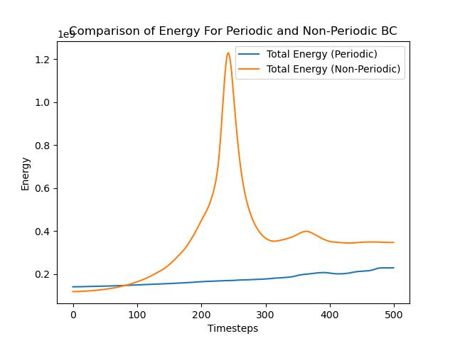

# Final Project

By Christian Denis for PHYS-512

## Part 1

Here we use an $n$-body simulation to show the behavior of a single free particle. This is more of a test than anything. Nothing too interesting is happening here.

We expect our particle to stay put, and indeed this is what is happening as demonstrated by this uneventful GIF.

Maybe there's some stuff happening on the smaller scale that is not displayed by the GIF however... Let's make a plot of the XY positions over time to see if there's stuff we're missing:

Looks pretty static.

## Part 2

Here we use the same $n$-body simulation to show two particles orbiting each other. This result is more interesting than the previous one, but is also sort of a test to make sure our simulation doesn't present any problems. The following GIF shows the simulation:

We see that the two particles are indeed in orbit.

An interesting observation we can make with this is the energy of the system at different points in time. If we plot the kinetic, potential and total energies of the system we get:

It appears as though the average energy is somewhat constant over the long term, however, it seems to be oscillating through the simulation, this is somewhat surprizing and I have a hard time coming up with an explanation...

It is worth pointing out that for smaller grid sizes there is one somewhat undesirable feature of the simulation is the fact that the particles keep drifting. I think this might be caused by the fact that the potential exists at the center of each cell in a grid which does not exactly correspond to the location of the particles, and the effect is more significant for larger cell sizes.

## Part 3

Here we simulate periodic and non-periodic systems of $n$ particles (here $n$ is 200000, in both cases).

We see that for the periodic case, clusters begin to form everywhere on the grid. For the non-periodic case, since the only force felt is towards the center of the grid, we see the particles collapse towards the center.

If we plot the total energy as a function of time, we obtain

## Part 4

If we plot the total energy as a function of time, we obtain

